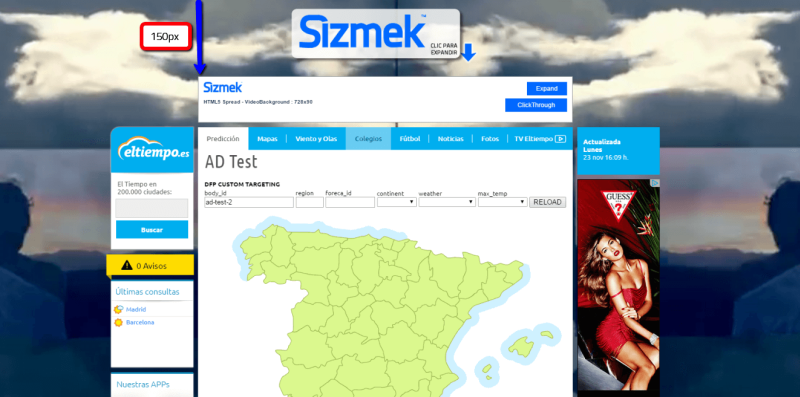
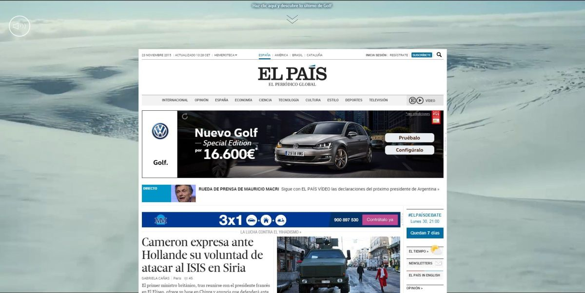
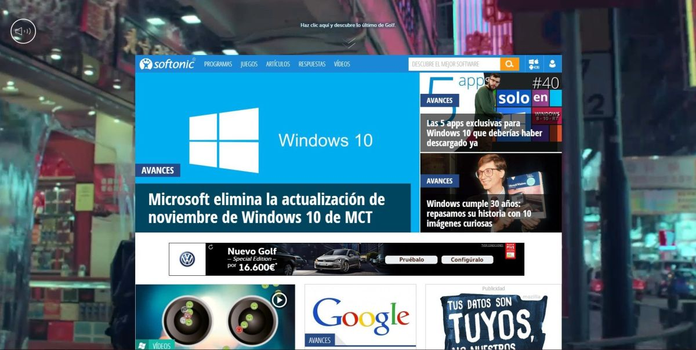

# Sizmek HTML5 VideoBackground

ADID: HTML5 VideoBackground v2.0 (ID: 32085856)

<a href="http://www.eltiempo.es/ad-test/?test_body_id=ad-test-2" target="_blank">DEMO</a>

* Please, confirm the initial Banner size (1x1, 728x90, 980x90, 980x250, etc) with the MediaAgency or MediaPlan

This format uses the Spread Format JS with a extra code (you can use the Spread's Guide format to setup and certificate it)

# Publishers certificate:
	- ElTiempo.es
	- As
	- Marca
	- ElPais
	- ElMundo
	- Softonic Home
	- Softonic Interiores
	- LaVanguardia

# New Variables:

mdPublisherGap: Gap between the content and the top

mdLoopVideo: the video will stop at the end (Depends of publishers specs)

mdMuteCollapseVideo: the video will mute the video when the Ad is closing the fullscreen mode(Depends of publishers specs)

# ScreenShots

